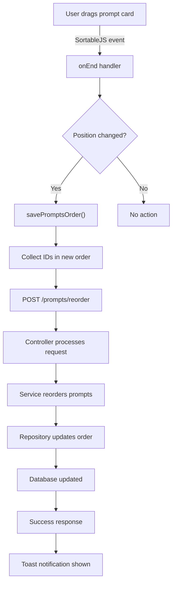

# Drag and Drop Reordering Feature

## Overview
This feature allows users to reorder prompts by dragging and dropping them in the list view.

## Implementation Details

### Database Changes
- Added `order` column to the `prompts` table (INTEGER, NOT NULL, DEFAULT 0)
- Created index `ix_prompts_order` for performance optimization

### Backend Implementation

#### Model Changes (app/models/prompt.py)
- Added `order` field to the Prompt model
- Updated `to_dict()` method to include the order field

#### Repository Changes (app/repositories/prompt_repository.py)
- Updated `_apply_sorting()` to support sorting by order
- Added `update_order()` method for updating a single prompt's order
- Added `bulk_update_order()` method for efficient batch updates

#### Service Changes (app/services/prompt_service.py)
- Changed default sorting to 'order' with ascending order
- Added `update_prompt_order()` method
- Added `reorder_prompts()` method for handling bulk reordering

#### Controller Changes (app/controllers/prompt_controller.py)
- Added `/prompts/reorder` POST endpoint
- Endpoint accepts JSON with `ordered_ids` array
- Returns success/error status

### Frontend Implementation

#### JavaScript (app/static/js/prompt-list.js)
- Integrated SortableJS library for drag-and-drop functionality
- Added `initDragAndDrop()` method to initialize sortable list
- Added `savePromptsOrder()` method to save new order via AJAX
- Drag handles prevent dragging when clicking on interactive elements

#### HTML Changes (app/templates/prompt/list.html)
- Added SortableJS CDN script
- Added drag handle icon to each prompt card
- Added `data-id` attribute to prompt containers

#### CSS Changes (app/static/css/style.css)
- Added styles for drag handle
- Added visual feedback during dragging (ghost, chosen, drag states)
- Cursor changes to indicate draggable elements

## Usage

1. Navigate to the prompts list page
2. Hover over the drag handle (vertical dots icon) on any prompt card
3. Click and drag to reorder prompts
4. Release to drop the prompt in the new position
5. The new order is automatically saved to the database

## Technical Flow

## Error Handling

- If the reorder request fails, a toast notification is shown
- User is prompted to reload the page to restore original order
- All database operations are wrapped in transactions for data integrity

## Best Practices Followed

### SOLID Principles
- **Single Responsibility**: Each component handles one specific aspect
- **Open/Closed**: Easy to extend sorting options without modifying existing code
- **Dependency Inversion**: Service depends on repository interface

### UI/UX Principles
- **User-Friendly**: Intuitive drag handle icon
- **Feedback**: Visual feedback during drag, toast notifications
- **Performance**: Optimistic UI updates, batch database operations
- **Responsive**: Works on different screen sizes

### Clean Code
- Descriptive method names
- Proper error handling
- Comprehensive documentation
- Separation of concerns between layers